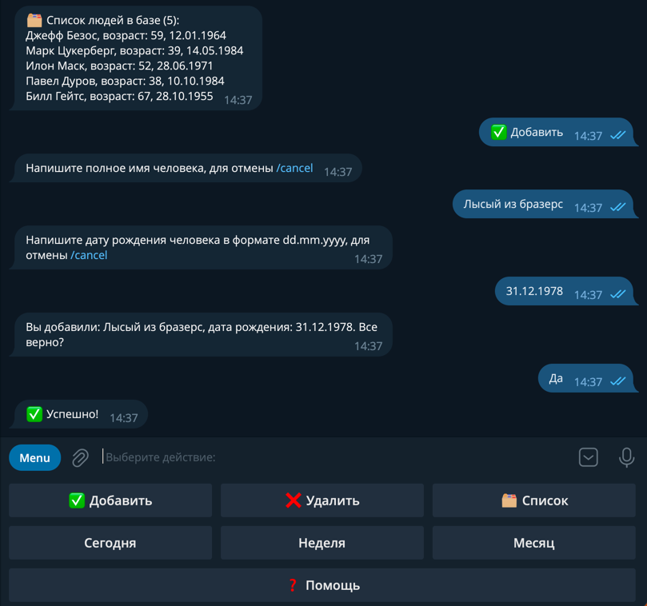

# Birthdaygram - telegram bot for birthday reminders

## Information

### Description

This project contains a telegram bot interface to easily manage the birthdays of your family, friends and acquaintances.

### Features

- All telegram users who use the bot has their own database table and can manage only their own list by the telegram bot interface. 
- Easy add or remove persons to your personal list.
- View your entire personal list of people.
- Ability to see who has a birthday today, within a week or within a month.
- If you set up a cron task according to the instructions below, then the bot starts checking all users for the presence of people whose birthday is today and exactly 7 days later, after which it sends a message with a reminder of this



### Author
Ilya Malashenko (github: melax08)

### System requirements
- Python 3.11
- Docker (19.03.0+) with docker compose for easy run

### Tech stack
- Poetry as project package manager
- python-telegram-bot 20+ as telegram bot library
- PostgreSQL 13+ as RDBMS
- sqlalchemy 2+ as ORM

## Installation and start
<details>
<summary>
Via docker
</summary>

Clone the repo and change directory to it:
```shell
git clone https://github.com/melax08/birthdaygram.git
```
```shell
cd birthdaygram
```

Create an **.env** file in the **src** directory and add the necessary environment variables to it (check src/.env.example for necessary variables.)
```shell
mv src/.env.example src/.env
```
```shell
vi src/.env
```

Run docker compose to create needed containers:
```shell
docker compose up -d
```
or
```shell
docker-compose up -d
```

If you need daily reminders from the bot, please follow the instructions below in the "Settings" section.

</details>

<details>
<summary>
Without docker
</summary>
There is no information yet.
</details>

## Settings

<details>
<summary>
Cron settings
</summary>

To check today birthdays via cron, add cron-job to host machine:

```shell
crontab -e
```
```shell
0 12,18 * * *  docker compose --file /home/birthdaygram/birthdaygram/docker-compose.yml exec birthdaygram_bot python cron.py
```
After --file specify the path to docker-compose.yml.
This cron job will run cron task on 12 AM and 6 PM every day.

</details>

## Mini documentation

In progress...
