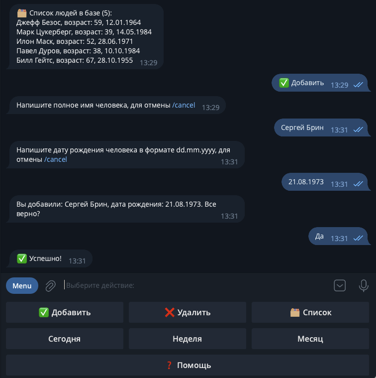

# Birthdaygram - telegram bot for birthday reminders


## Information

### Description

This project contains a telegram bot interface to easily manage the birthdays of your family, friends and acquaintances.

### Features

- All telegram users who use the bot has their own database table and can manage only their own list by the telegram bot interface. 
- Easy add or remove persons to your personal list.
- View your entire personal list of people.
- Ability to see who has a birthday today, within a week or within a month.
- A scheduler that will run at the specified time then the bot starts checking all users for the presence of people whose birthday is today and exactly 7 days later, after which it sends a message with a reminder of this



### Author
Ilya Malashenko (github: melax08)

### System requirements
- Python 3.11
- Docker (19.03.0+) with docker compose for easy run

### Tech stack
- Poetry as project package manager
- python-telegram-bot 20+ as telegram bot library
- PostgreSQL 13+ as RDBMS
- sqlalchemy 2+ as ORM

## Installation and start
<details>
<summary>
Via docker
</summary>

Clone the repo and change directory to it:
```shell
git clone https://github.com/melax08/birthdaygram.git
```
```shell
cd birthdaygram
```

Create an **.env** file in the **src** directory and add the necessary environment variables to it (check src/.env.example for necessary variables.)
```shell
mv src/.env.example src/.env
```
```shell
vi src/.env
```

Run docker compose to create needed containers:
```shell
docker compose up -d
```
or
```shell
docker-compose up -d
```

</details>

<details>
<summary>
Without docker
</summary>
There is no information yet.
</details>

## Settings and documentation

All bot constants you can find in src/bot/constants/constants.py. 
Some of them you can set in .env file (see example in .env.example file).

<details>
<summary>
Scheduler settings
</summary>
<br>

At the specified time, the scheduler runs a task to check all tables in the database for records of people whose birthday is today or exactly 7 days from now. Those who have these people added to the database will receive a telegram message with information about birthdays.

You can set a **RUN_SCHEDULER_HOURS** constant in the file .env.
Example:

```shell
RUN_SCHEDULER_HOURS=12 18
```

The scheduler tasks will be added to the queue when the bot starts. 
In this example, the scheduler will run at 12:00 (12:00 AM) and 18:00 (6:00 PM)

If you set RUN_SCHEDULER_HOURS to the empty value (RUN_SCHEDULER_HOURS=), the scheduler will not work.

</details>

